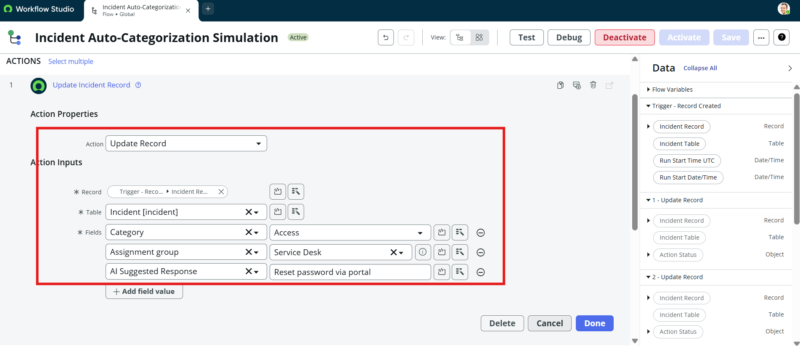
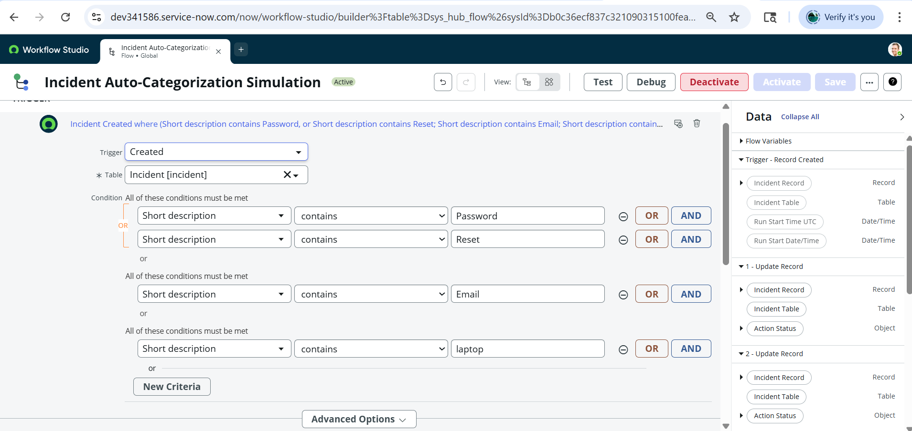
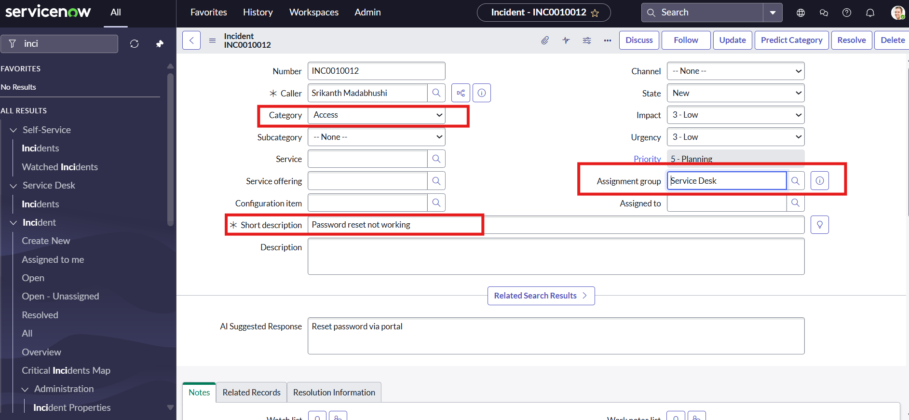

# ServiceNow_ITSM_Project1
Simulated AI for Incident Auto-Categorization in ServiceNow (Yokohama PDI)
# 🚀 ServiceNow ITSM + AI Predictive Intelligence Project

## 📘 Overview
This project demonstrates how **AI and Flow Designer automation** can be integrated with **ServiceNow ITSM (Incident Management)** to automatically categorize incidents using predictive logic — simulating real-world AI workflows.

---

## 🧠 Objectives
- Automate incident classification using Flow Designer
- Simulate AI-driven category prediction (password, email, laptop, VPN, etc.)
- Create a visual flow diagram for understanding the process
- Capture and present ServiceNow UI screenshots for a portfolio-ready showcase

---

## ⚙️ Tools & Platform
- **ServiceNow Developer Instance (Zurich Release)**
- **Flow Designer**
- **Incident Management (ITSM)**
- **GitHub for Portfolio**
- **Draw.io / Lucidchart for Diagrams**

---

## 🧩 Project Workflow
### 1️⃣ Create Incident Prediction Flow
- Navigate to **Flow Designer → New Flow**
- Trigger: *When Incident is Created or Updated*
- Add Decision logic based on keywords:
  - “password” → Access  
  - “email” → Software  
  - “laptop / hardware” → Hardware  
  - “VPN” → Network  
  - Else → General  

### 2️⃣ Update Record Action
- For each branch, use **Update Record** → Category = chosen value

### 3️⃣ Test & Validate
- Create new incidents (different short descriptions)
- Observe category auto-updates
- Capture screenshots for documentation

---

## 📸 Screenshots
| Step | Screenshot |
|------|-------------|
| Flow Design |  |
|Sample Incidnets| [Flow Setup](Screenshots/1. Samples Incidents.png)
|Creating Custom Field|[Flow Process](Screenshots/2. Custom Feild.png)
| Flow Designer Setup |  |
| Flow Designer Setup |  |
| Incident Results|  |

---

## 🎯 Outcome
This project automates ITSM incident categorization using AI-style logic and Flow
